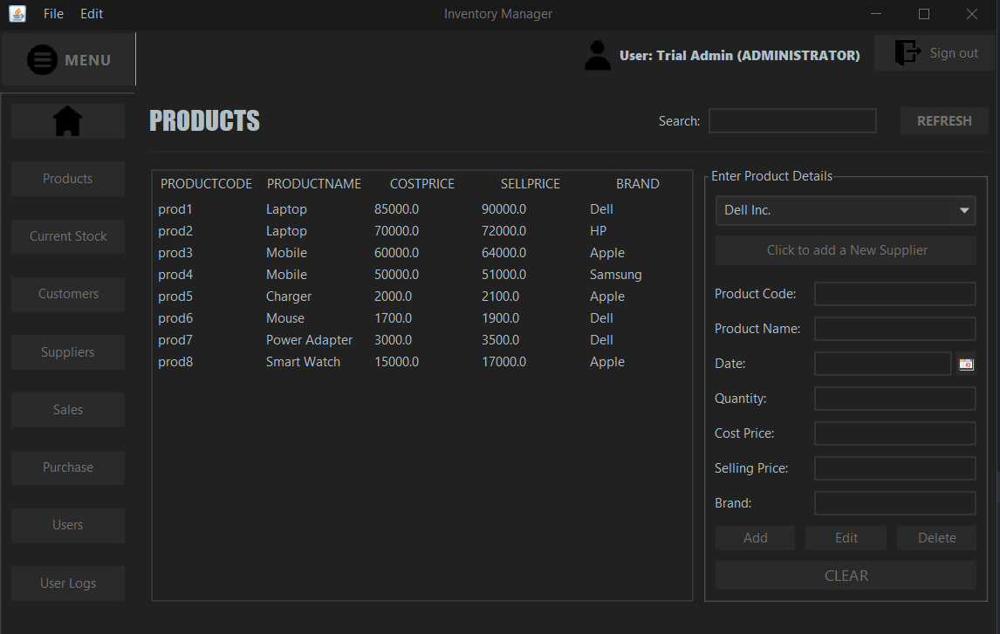
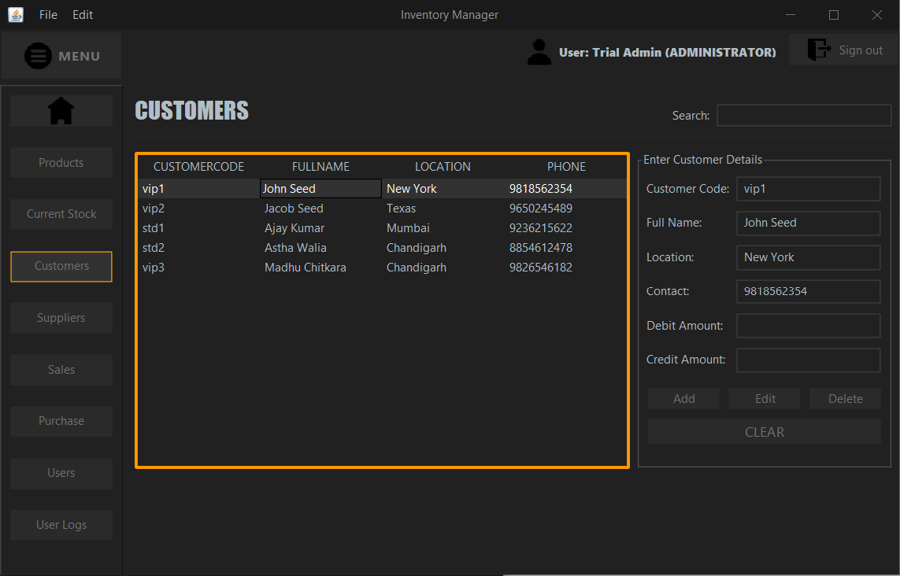

# Inventory Management System

A Java Swing desktop application with a MySQL database using JDBC API.  
Designed for small and mid-sized stores to manage:

- Products
- Customers
- Suppliers
- Users
- Sales & Purchases

---

## Features of the Application

- Real-time stock, sales, and purchase management  
- Two user roles: **Administrator** and **Employee**  
- Auto stock updates during transactions  
- Quick search in every module  
- Product details fetched by code  
- User login/logout logs  

---

## Technologies Used

- Java Swing & JDBC  
- MySQL  
- IntelliJ / NetBeans IDE  

---

## Source Code

- **DAO** – Database operations  
- **DTO** – Data transfer layer  
- **Database** – Connection & credentials  
- **UI** – Swing-based GUI classes  

[➡ Source Code](InventoryManagementSystem-master/src/com/inventory/)

---

## Application Preview

### Login Page

### Dashboard/Welcome Page

### Products

### Current Stock

### Suppliers

### Customers

### Sales

### Purchase

### Users

### User Logs

---

## ER Diagram

